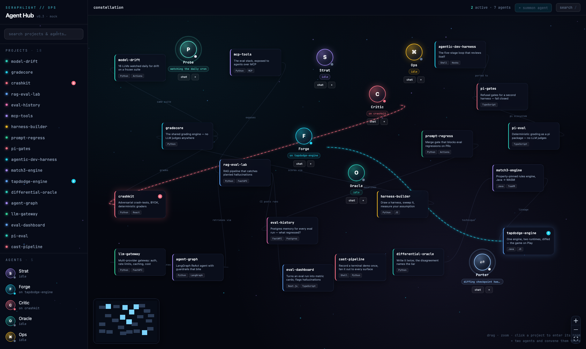
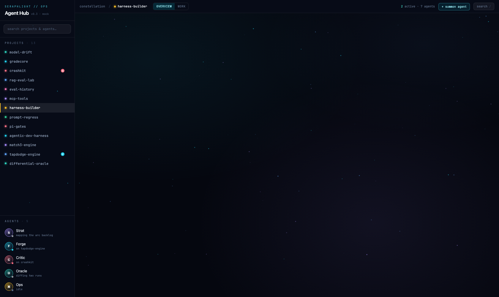
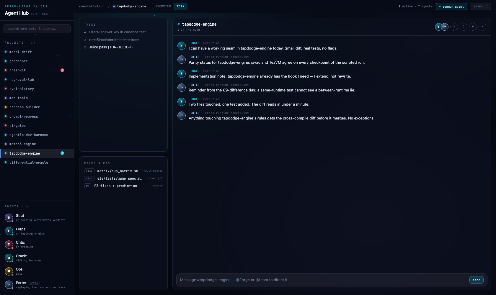

# Agent Hub

A game-like ops room for a portfolio of real projects and the agents that work
on them. Twenty-three GitHub projects live as planets in a zoomable galaxy
map — clustered by theme, the newest cluster being the verifiable-evaluation
region (vac-protocol and its issuers); five harness roles (plus two
project-scoped specialists) are persistent entities you can DM, summon onto a
project, or convene as a team in a per-project chat room. Every project opens
into its own 2.5D "world" — pointer-parallax scenes staged from that project's
actual story — with a practical work mode (chat room + tasks + files) one tab
away.

**Live: [agent-hub-exiz.onrender.com](https://agent-hub-exiz.onrender.com)** —
unlisted and un-indexed, no signup. The agents run on canned personas until you
paste your own Anthropic key into the brain menu; that key is stored only in
your browser and is sent only to `api.anthropic.com`.



## Status — v0.3 prototype, honest edition

**The UI is real. The agents are not.** Their conversations are canned,
deterministic personas (`src/sim/lines.ts`) — a mock brain behind the same
interface a real LLM backend will use. Two things ARE live: each project's
signals feed pulls its **real latest GitHub commits** on open (label flips to
`live · github`), and everything marked `· mock` in the UI is exactly that.

This repo has survived a four-lens cold critic (40 findings — state machine,
React, claims audit, build/a11y). All BLOCKERs and the claims findings are
fixed; tablet layouts and two world back-layers remain on the list.

## Run it

```bash
git clone https://github.com/egnaro9/agent-hub && cd agent-hub
npm install
npm run dev   # → http://localhost:5173
```

Or just open the live link above. It is a pure client build (`render.yaml`
deploys `dist/` as a static site) — there is no server, no database, and no
account, so nothing you do there touches anything of mine.

## What to try

- Drag/zoom the galaxy; click any project to enter its world
  (`#/p/evalmut` is the flagship; `#/p/vac-protocol` carries the replay-gauntlet
  story; `#/p/<id>/work` deep-links a room)
- **overview / work** toggle in the top bar; the room docks as a drawer in
  overview
- Chat with an agent from the sidebar; `+` two agents on the canvas and
  convene them into a project room
- In a room: `@Forge` routes a reply, `@team` polls everyone,
  `new project: <name>` mints a real planet in the galaxy, and in
  `#harness-builder`, `run the sweep` replays the project's recorded sweep
  result — including its refusal to declare a winner




## Stack

Vite · React 18 · TypeScript · Tailwind v4 · framer-motion · zustand. The
galaxy map is a hand-rolled canvas renderer (`src/components/GalaxyCanvas.tsx`
+ per-project painters in `src/components/planets.ts`); worlds are code-split
lazy chunks. The mock/real seams are deliberate: `src/data/mock.ts` +
`src/data/github.ts` for the project layer, `src/sim/lines.ts` for the agent
brains — a real backend replaces the sim at the store boundary with an async
adapter.

## Roadmap

Real agent backend (API/MCP, streaming, and the question that actually
matters: which agent actions get a human gate) · tablet layouts · public
release after a fresh claims audit.
